# BLACK JACK 

**Developer: Gabriel S**

💻 [Visit live website](https://black-j.herokuapp.com/)

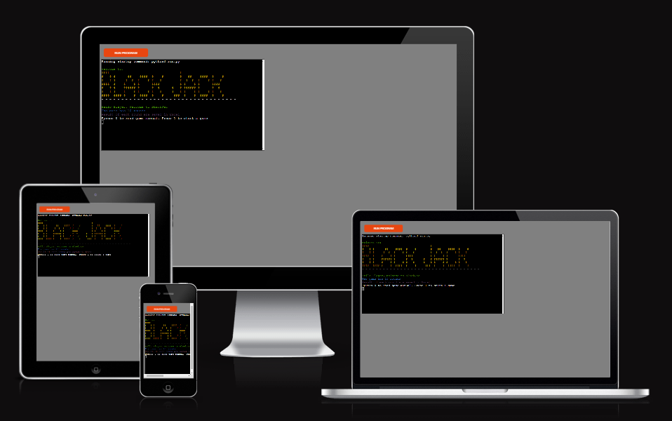

## About

This is a command-line version of the Casino Black Jack game.

The game is played between Casino and Player. Player make a bet and after the game start. The winning side receives double of its betting amount.

Rules of the game are:

    1) The sum of the cards should not be over 21, otherwise casino/player who has the hand loses straight away
    2) If the sum of the cards is 21, player/casino who have this hand wins straight away.
    3) If casino and player do not want to take other card. We see whose sum is higher to determine a winner.

## Table of Contents
  - [Project Goals](#project-goals)
    - [User Goals](#user-goals)
    - [Site Owner Goals](#site-owner-goals)
  - [User Experience](#user-experience)
    - [Target Audience](#target-audience)
    - [User Requirements and Expectations](#user-requirements-and-expectations)
    - [User Manual](#user-manual)
  - [User Stories](#user-stories)
    - [Users](#users)
    - [Site Owner](#site-owner)
  - [Technical Design](#technical-design)
    - [Flowchart](#flowchart)
  - [Technologies Used](#technologies-used)
    - [Languages](#languages)
    - [Frameworks & Tools](#frameworks--tools)
    - [Libraries](#libraries)
  - [Features](#features)
  - [Validation](#validation)
  - [Testing](#testing)
    - [Manual Testing](#manual-testing)
    - [Automated Testing](#automated-testing)
  - [Bugs](#bugs)
  - [Deployment](#deployment)
  - [Credits](#credits)
  - [Acknowledgements](#acknowledgements)

## Project Goals

### User Goals


- Play a fun game.
- Receive anotation from the game to make the game enjoyable.
- Well designed game when the text of the game is easy readable

### Site Owner Goals

- Create user friendly and intiutive environment for the game.
- Create a game that save log file of the game.
- Create a code which collect statistics about results of the game.

## User Experience

### Target Audience

The target audience of the game is  people 18+.

### User Requirements and Expectations

- Simple, easy, intuitive interface to play a game.
- The text of the game is easy to read.
- Events, Results of the rounds and Game are presented to the user.

### User Manual

<details><summary>Click here to view instructions</summary>

#### Main Menu
The main menu showcases an ASCII art representation of the title 'Black Jack'. Beneath the welcoming graphic, users are given two choices:

1. Read game manual.
2. Start a game.

To access the game rules, user may input "0". For gameplay, any other key can be pressed.

#### Game rules

Rules of the game are:

    1) Player and Casino receives two random cards from the followoing array: unlimitted_deck = [2, 3, 4, 5, 6, 7, 8, 9, 10, 10, 10, 10, 11]
    2) Player can see both his cards and only one card of the casino
    3) If at some point of the game the sum of the cards is over 21 casino/player who have the cards loses straight away
    4) If at some point of the game, the sum of the card is 21, casino/player who have the cards wins straight away.
    5) If sum of the cards is bellow 21 for both players and noone wants to take additional card, we compaire sum of player and casino cards to define a winner.

    6) After receiving two cards the player may choose to receive additional card.
    7) If player do not want to take additional card, casino check if Casino SUM > Player SUM and if Casino SUM 17. If it is the case, casino takes additional card.  If the above statement is not true, casino does not take any additional card.

#### Game

When the user click "RUN Program"
He is welcomed to the game. The game informs him that he is going to play a game of 10 rounds. Website informs him that results of the game will be saved to Excel.

After the user has an option to press 0 to see game manual,  or to press any other key to start a game.

When the game starts the user receives 2 cards and see both of them. Casino also receives two cards but player can see only 1 of them.


After user has an option to take an additional card. If player receive an additional card we have three outcomes
1. Player SUm  > 21. In this situation the player loses
2. Player sum = 21. Player wins
3. Player Sum <21 in this case player may take additional card. If player does not take additional card the casino starts playing.

After the user rejects to take a new card the casino starts playing. Casino Checks if casino sum > player sum. In this is the case, casino wins.

If Casino SUM <= Player SUM and Casino Sum < 17 the casino takes additional cards.
in this senario we have the following outomes:
1. Casino Sum > 21. In this scenario casino loses the game.
2. Casino Sum = 21. In this scenario casino wins.
3. If casino Sum > player sum casino wins
4. If casino Sum <= Player Sum  and Casino Sum > 17. We compaire the sums of Casino and Player
to define a winner.
5. If casino Sum <= Player Sum  and Casino Sum < 17. Casino takes a new card and we check again if statements from 1-5 are true. Finaly the casino wins or loses the game according to the if statements above


#### End of a Game 
At the end of the game the user has an option to play a game again.

Here is an output the user is going to see:

- - - - - - - - - - - - - - - - - - - - - - - - - - - - - - - - - - 
- - - - - - - - - - - - - - - - - - - - - - - - - - - - - - - - - - 
After 10 rounds the score is 
PLAYER:2 CASINO:0
Hello worldplayer won a game of 10 rounds
PRESS ANY KEY TO PLAY. PRESS 0 TO SEE GAME STATS:


#### Go to main menu
At the end of the game the user haas an option to restart the game.
To restart it he need to press any key exepct "0" After that the user
see game's default menue.

#### See your statistics
At the end of the game the user has an option to see statistics of the game.

He will see a message: 
    "PRESS ANY KEY TO PLAY. PRESS 0 TO SEE GAME STATS"
If the user press 0 he will see an output in the following format:
    The stats are: 
    PLAYER'S PROPABILITY TO WIN :40.0%
    CASINO'S PROPABILITY TO WIN:58.75%
    THE PROBABILITY FOR A DRAW IS: 1.25%


</details>

[Back to Table Of Contents](#table-of-contents)

## User Stories

### Users

1. I desire distinct choices to choose from on the main menu.
2. I would like the ability to access and read the game rules.
3. I expect to receive continuous, real-time feedback throughout the game.
4. I expect receiving feedback when a round concludes.
5. I expect to receive feedback when the game concludes.
6. I want to visually observe the new card I receive when dealt a new card.
7. I want to visually observe the new card the casino receives when it recives a new card.

### Site Owner
8. I want to be able to see the propabilites casino winning losing or draw the game
9. I want to provide feedback to the user when they make incorrect inputs or when deciding whether to draw a new card or not.
10. I aim for the game text to be easily readable and comprehensible for the user.


[Back to Table Of Contents](#table-of-contents)

## Technical Design

### Flowchart

The provided flowchart presents a concise overview of the application's structure and logic.

<details><summary>Flowchart</summary>

</details>

## Technologies Used

### Languages

- [Python](https://www.python.org/)

### Frameworks & Tools

- [Diagrams.net](https://app.diagrams.net/) was used for flowchart creation.
- [Git](https://git-scm.com/) was used for version control to push changes from gitpod to github
- [GitHub](https://github.com/) was used to store a code.
- [Google Cloud Platform](https://cloud.google.com/cloud-console/) It was utilized to handle access and permissions for various Google Services, including Google authentication, Google Sheets, and others.
- [Google Sheets](https://docs.google.com/spreadsheets) were used to store game logs and game's statistics
- [PEP8](http://pep8online.com/) was used as a python code checker.
- [heroku Platform](https://www.heroku.com//) was user to deploy a game to live website.
- [Gitpod](https://www.gitpod.io/)
VSCode was used to write the project code using Code Institute template

### Libraries

#### Python Libraries
- random - used to assign two random cards from the deck to casino and player
- time - used to displayed delayed messages in the terminal
- date - was user to record date and time of the log line, which is saved in Excel

#### Third Party Libraries
- [colorama](https://pypi.org/project/colorama/) - Was used to make the text of the game more readable and experience more enjoyable.
- [gspread](https://docs.gspread.org/en/latest/) - I utilized the gspread library to perform tasks such as adding and manipulating data within my Google spreadsheet.
- [google.oauth2.service_account](https://google-auth.readthedocs.io/en/master/) - The module employed to establish the necessary authentication for accessing the Google API and linking my Service Account with the Credentials function is responsible for this setup. As a result, a creds.json file is generated, containing all the required details for the API to access the associated Google account. During deployment to Render, this information is stored within the config var section.

[Back to Table Of Contents](#table-of-contents)

## Features

### Main menu

- Provides user with ASCII art welcome message

User story: 11

<details>
    <summary>Welcome Message</summary>

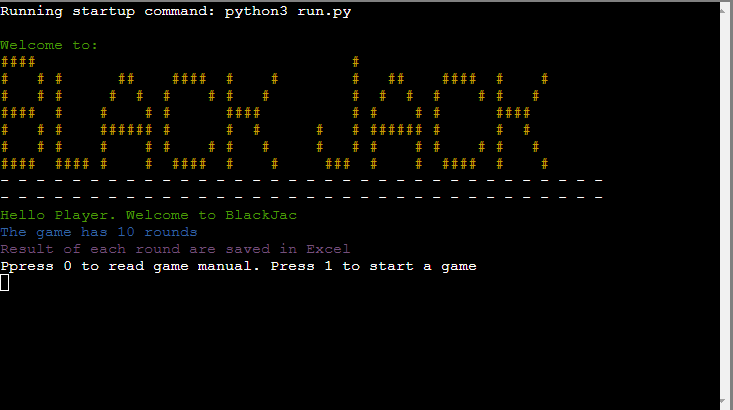
</details>

- A Menue to select option to view the game rules or continue playing a game

User story: 1, 2

<details>
    <summary>Game Welcome Menu</summary>

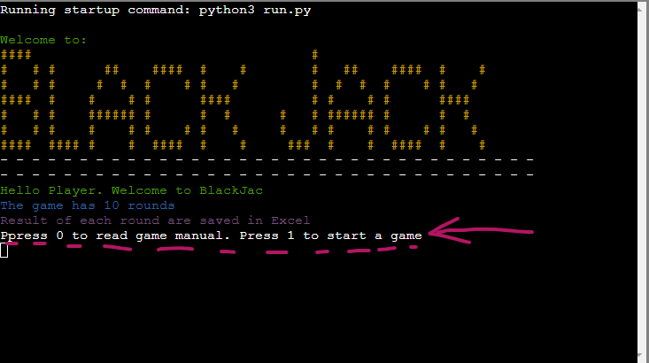
</details>

### Game rules
- Game rules description, if user select an option to see the game.

User Story: 2

<details>
    <summary>Game Rules</summary>

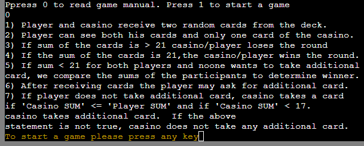
</details>
-----------------------------------------


- Menu to start a game after rules output.

<details>
    <summary>Game Rules Menu</summary>

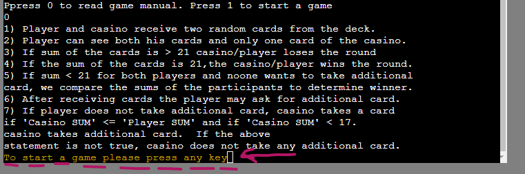
</details>
  ---------------------------------------

User Story: 1

### Playgame

User can see his cards and sum of his cards.

User story: 3

<details>
    <summary>Player's Cards</summary>

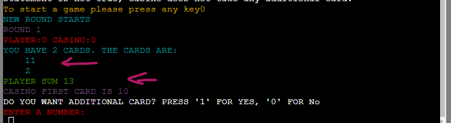
</details>
-------------------------------------
<details>
    <summary>Player's Cards</summary>


</details>
---------------------------------------------

User can see the first card of the casino.

User Story: 3

<details>
    <summary>Casino's Card</summary>

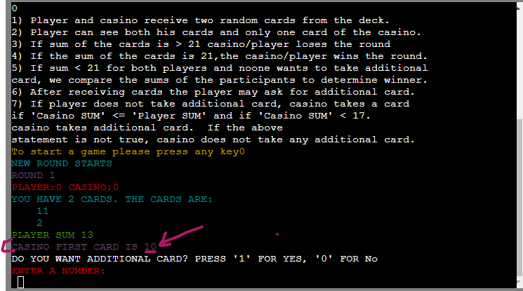
</details>

-------------------------------------

User has an option to choose to get a new card or not.

User Story: 7a

<details>
    <summary>New Card</summary>

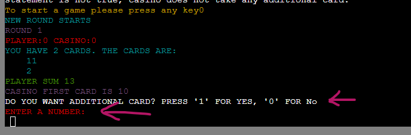
</details>

---------------------------------
User sees feedback when the casino playing.

<details>
    <summary>Casino play</summary>

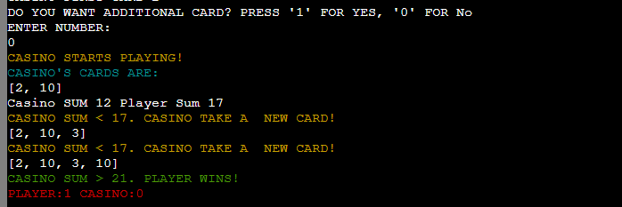
</details>


User sees the result of a round:
<details>
    <summary>Round result</summary>

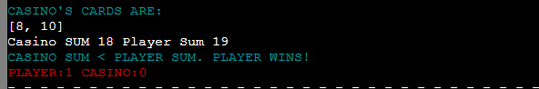
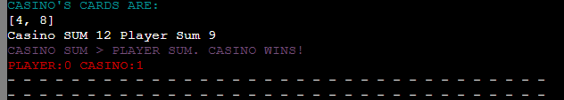
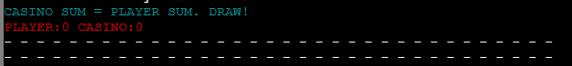
</details>

---------------------------------

User sees the round score.
<details>
    <summary>Round Result</summary>

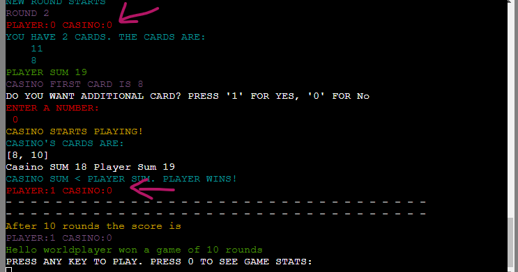
</details>

Game Results: Score after 10 rounds.
<details>
    <summary>Game Result</summary>

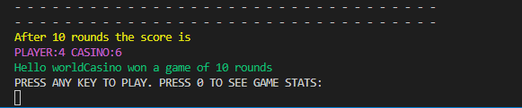
</details>
---------------------------------
An Ooption to view game stats or continue playing

<details>
    <summary>Game End Menu</summary>


</details>

Stat output

<details>
    <summary>Round Stats</summary>

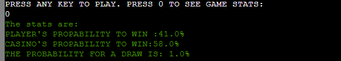
</details>

### Play options

### Users greeting


### Game


### Finished Game options


#### Play 

#### Go to main menu


#### See your statistics

#### Quit game


### User Input Validation
- If the user's input does not match the expected format, an error message is shown.
- The user is prompted to enter a new input and given instructions on how to format it correctly.

<details>
    <summary>User Option Validation Screenshot.</summary>

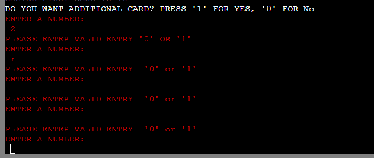
</details>


## Validation

[PEP8 Validation Service](https://pep8ci.herokuapp.com/) The code underwent verification for PEP8 compliance and successfully passed without any errors or warnings.

<details><summary>PEP3 check for run.py</summary>
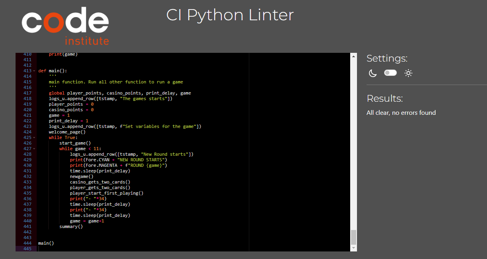
</details>


## Testing

The testing approach is as follows:
1. Manual testing of user stories
2. Automated unit testing using the Python unittest library

### Manual Testing
<details><summary>See user stories testing</summary>

1. I want to have clear options to select in the main menu

| **Feature**   | **Action**                    | **Expected Result**          | **Actual Result** |
| ------------- | ----------------------------- | ---------------------------- | ----------------- |
| Main menu | Select option 1 | Users are presented with game rules | Works as expected |
| Main menu | Select option 2 | Users are asked if they played the game before | Works as expected |

<details><summary>Screenshot</summary>

</details>

2. I want to be able to read the rules of the game

| **Feature**   | **Action**                    | **Expected Result**          | **Actual Result** |
| ------------- | ----------------------------- | ---------------------------- | ----------------- |
| Main menu | Select option 1 | Users are presented with game rules | Works as expected |

<details><summary>Screenshot</summary>

</details>

3. I want to personalise the game and enter my name

| **Feature**   | **Action**                    | **Expected Result**          | **Actual Result** |
| ------------- | ----------------------------- | ---------------------------- | ----------------- |
| Play game options | Select option 1 (log-in) | Users are asked to input their email addresses, and once validated, a greeting message with their name is displayed. Names are displayed during the game | Works as expected |
| Play game options | Select option 2 (sign-up) | Users are asked to input their names, once validated the names are saved and greeting message displayed. Names are displayed during the game | Works as expected |

<details><summary>Screenshot</summary>

</details>
<details><summary>Screenshot</summary>

</details>

4. I want to be able to log-in if I return to the game

| **Feature**   | **Action**                    | **Expected Result**          | **Actual Result** |
| ------------- | ----------------------------- | ---------------------------- | ----------------- |
| Play game options | Select option 1 (log-in) | Returning users are asked to input the email address they registered before and once validated, a greeting message with their name is displayed | Works as expected |

<details><summary>Screenshot</summary>

</details>

5. I want to receive a real time feedback throughout the game

| **Feature**   | **Action**                    | **Expected Result**          | **Actual Result** |
| ------------- | ----------------------------- | ---------------------------- | ----------------- |
| User Input Validation & Feedback through game play | Players will be informed if their input is invalid | Error messages displayed | Works as expected |

<details><summary>Screenshots</summary>


</details>

6. I want to get a feedback when I win the game

| **Feature**   | **Action**                    | **Expected Result**          | **Actual Result** |
| ------------- | ----------------------------- | ---------------------------- | ----------------- |
| Game screen | Player has connected 4 pieces in a row | Message is displayed with the winning player's name | Works as expected |

<details><summary>Screenshots</summary>


</details>

7. I want to be able to play multiple games when I'm logged in

| **Feature**   | **Action**                    | **Expected Result**          | **Actual Result** |
| ------------- | ----------------------------- | ---------------------------- | ----------------- |
| Finished Game options | User selects play again option  | The game restarts for the same players | Works as expected |

<details><summary>Screenshot</summary>

</details>

8. I want a random selection of the player to start a new game

| **Feature**   | **Action**                    | **Expected Result**          | **Actual Result** |
| ------------- | ----------------------------- | ---------------------------- | ----------------- |
| Game screen | Once players have logged-in or signed-up the game is loaded  | Different user names display | Works as expected |

<details><summary>Screenshots</summary>


</details>

9. I want to see how many games I've won so far

| **Feature**   | **Action**                    | **Expected Result**          | **Actual Result** |
| ------------- | ----------------------------- | ---------------------------- | ----------------- |
| Finished Game options | Select option 3  | Display number of games won for Player1 & Player2 | Works as expected |

<details><summary>Screenshots</summary>

</details>

10. I want users to have a positive experience whilst playing the game

| **Feature**   | **Action**                    | **Expected Result**          | **Actual Result** |
| ------------- | ----------------------------- | ---------------------------- | ----------------- |
| Across all screen | Simple navigation and game play  | Colored messages and straightforward instructions | Works as expected |

<details><summary>Screenshots</summary>


</details>

11.  I want users to easily select options from the menu

| **Feature**   | **Action**                    | **Expected Result**          | **Actual Result** |
| ------------- | ----------------------------- | ---------------------------- | ----------------- |
| Across all screen | User inputs invalid numeric value | Users are asked to try again between available options from the menu | Works as expected |

<details><summary>Screenshots</summary>


</details>

12.  I want user names and emails to be saved to Google Spreadsheet

| **Feature**   | **Action**                    | **Expected Result**          | **Actual Result** |
| ------------- | ----------------------------- | ---------------------------- | ----------------- |
| Log-in | Both users input their names and email address which has not been previously registered  | Username and email addresses are saved to Google Spreadsheet to the next available rows in columns 1 & 2 respectively | Works as expected |

<details><summary>Screenshot</summary>

</details>

13.  I want the user to get feedback in case of wrong input

| **Feature**   | **Action**                    | **Expected Result**          | **Actual Result** |
| ------------- | ----------------------------- | ---------------------------- | ----------------- |
| Across all screen | User inputs invalid numeric value in the menu or game. User inputs invalid value during log-in or sign-up | Feedback message displayed to the user | Works as expected |

<details><summary>Screenshots</summary>


</details>

14.  I want data entry to be validated, to guide the user on how to correctly format the input

| **Feature**   | **Action**                    | **Expected Result**          | **Actual Result** |
| ------------- | ----------------------------- | ---------------------------- | ----------------- |
| Across all screen | User inputs invalid data | Feedback message with instructions diplayed to the user | Works as expected |

<details><summary>Screenshots</summary>


</details>

</details>

### Automated Testing
<details><summary>See unit testing</summary>

- I wrote unit tests using Python unittest library
- I tested separate functions to verify correct user input:
  - validation of user email and user name input

I needed to amend the function and add 'Try Except' blocks to handle TypeError.
Initial error called - 'TypeError: object of type 'int' has no len()'


  - validation of data in log_in_players and register_new_players

When running the test initially, there was a TypeError called - 'TypeError: 'int' object is not iterable'. I handled this error by adding 'Try Except' blocks to both functions. This resulted with passed test.


</details>

[Back to Table Of Contents](#table-of-contents)
## Bugs

| **Bug** | **Fix** |
| ------- | ------- |
| When selecting 'go back to main menu' option after the game has finished, the game title was not displayed | Correct the function's indentation |
| When selecting a correct menu option after a few wrong numeric inputs the relevant game option was not called | Move the while loop at the top within the function |
| Underscores within the game title were not displayed after deployment to Render portal | Changed color settings for yellow & red |
| Gradient background color does not take up the full screen size | Add background-attachment property |
| Players names input values are not displayed in the game – instead of name a “‘Player1’’s / ‘Player2’’s move.” is shown | Reassign a value of player1name & player2name to the indexed-0 value (name) input by the user in ‘create_new_players’ function |
| Users input data was recorded in the same row in four columns instead of 2 separate rows | Created a list of players and while loop inside the 'register_new_players' function for Google Spreadsheet update separately for two players |
| There were quite a few errors and warnings related to exceeded number of characters in line, whitespace within a blank line, trailing white spaces or missing white spaces around operators | Split the comments or print functions into two separate rows maintaining correct indentation. Followed a guidance within pep8 online tool and corrected all warnings and errors |

## Deployment

### Render
This application has been deployed from GitHub to Render by following the steps:

1. Create or log in to your account at render.com
2. Make sure you have connected your GitHub account to Render.com - follow the steps to Get Started and Sign up for Render. Click “New +” and select “Web Service”, on the right of the page, select “+ Connect account” for GitHub, ensure All repositories is selected and click “Install”
4. Web service creation: Click “New +” and then “Web Service”. Search for relevant repo and click “Connect”.
5. Settings: the web service's configuration settings are required to ensure the application is configured correctly. Add a Setting Name, leave Root Directory blank, add Environment 'Python3', Region (The physical location of the server hosting the web service), Branch - main
6. Set the Build Command:
    ```
    pip install -r requirements.txt && npm install
    ```
7. Set the Start Command
    ```
    node index.js
    ```
8. Set up Environment Variables: Scroll down and click “Advanced” and “Add Environment Variable”. Add a key 'PORT' and value of '8000' and 'PYTHON_VERSION' with value of 3.10.7.
9. Click “Add Secret File” and add a Filename 'creds.json' and file content.
10. Click “Create Web Service” and wait for the project to build. First, the build is initiated. Then the build and deployment processes are carried out. Finally, the application is deployed and ready for public viewing.


### Forking the GitHub Repository
1. Go to the GitHub repository
2. Click on Fork button in top right corner
3. You will then have a copy of the repository in your own GitHub account.
   
### Making a Local Clone
1. Go to the GitHub repository 
2. Locate the Code button above the list of files and click it
3. Highlight the "HTTPS" button to clone with HTTPS and copy the link
4. Open Git Bash
5. Change the current working directory to the one where you want the cloned directory
6. Type git clone and paste the URL from the clipboard ($ git clone <span>https://</span>github.com/YOUR-USERNAME/YOUR-REPOSITORY)
7. Press Enter to create your local clone

[Back to Table Of Contents](#table-of-contents)

## Credits

### Images
- [Flaticon](https://www.flaticon.com/free-icon/connect_1707222) was used for the website favicon

### Code
- [ASCII Art Generator](http://patorjk.com/software/taag/) was used to create game title
- Code Institute - for git template IDE and "Love Sandwiches - Essentials Project" which helped me with connecting the Google Spreadsheet to my project.
- [ColorSpace](https://mycolor.space/gradient) was used to create a gradient button and background effect
- How to install a Python module, eg. [email validation](https://pypi.org/project/email-validator/Installing)
- [gspread documentation](https://docs.gspread.org/en/latest/user-guide.html) explained how to obtain a specific value from the google spreadsheet
- Instructions how to print colored text from [this](https://ozzmaker.com/add-colour-to-text-in-python/) and [this](https://stackabuse.com/how-to-print-colored-text-in-python/) sources
- [Stack overflow](https://stackoverflow.com/questions/20302331/typing-effect-in-python) helped me create typing effect in games rules
- [Stack overflow](https://stackoverflow.com/questions/517970/how-to-clear-the-interpreter-console) code used to clear the terminal console
- Youtube video on [Unit Test in Python](https://www.youtube.com/watch?v=1Lfv5tUGsn8) made by Socratica was very helpful to understand the concept of unit tesing
- Youtube tutorial [“Python Connect 4 Tutorial”](https://www.youtube.com/watch?v=gvP0gNSO17k&t=429s) made by [Spencer Lepine](https://www.youtube.com/channel/UCBL6vAHJZqUlyJp-rcFU55Q) - I used a part of Spencer's code for display of the game board, moves of alternative players and saving last move's coordinates on the board
- Youtube tutorial [“Creating a Connect 4 Game in Python”](https://www.youtube.com/watch?v=Bk2ny_aeG-Y) made by [“Painless Programming”](https://www.youtube.com/channel/UC8ck1Yks7yP33XInXw5GZIw) -  inspired me to create a schemat for winning move logic
<details><summary>See winning move schemat</summary>

</details>

## Acknowledgements
I would like to thank everyone who supported me in the development of this project:
- My mentor Mo for professional guidance, helpful feedback and words of encouragement whilst creating the project. Also, for encouraging me to learn about the unit test and including it within this project.
- My partner for his support and playing/testing the game with me
- Code Institute community on Slack for resources and support