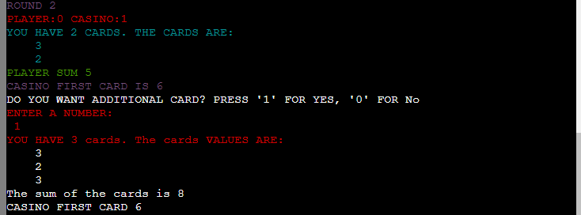

# BLACK JACK 

**Developer: Gabriel S**

💻 [Visit live website](https://black-j.herokuapp.com/)

## About

This is a command-line version of the Casino Black Jack game.

The game is played between Casino and Player. Player make a bet and after the game start. The winning side receives double of its betting amount.

Rules of the game are:

    1) The sum of the cards should not be over 21, otherwise casino/player who has the hand loses straight away
    2) If the sum of the cards is 21, player/casino who have this hand wins straight away.
    3) If casino and player do not want to take other card. We see whose sum is higher to determine a winner.

## Table of Contents
  - [Project Goals](#project-goals)
    - [User Goals](#user-goals)
    - [Site Owner Goals](#site-owner-goals)
  - [User Experience](#user-experience)
    - [Target Audience](#target-audience)
    - [User Requirements and Expectations](#user-requirements-and-expectations)
    - [User Manual](#user-manual)
  - [User Stories](#user-stories)
    - [Users](#users)
    - [Site Owner](#site-owner)
  - [Technical Design](#technical-design)
    - [Flowchart](#flowchart)
  - [Technologies Used](#technologies-used)
    - [Languages](#languages)
    - [Frameworks & Tools](#frameworks--tools)
    - [Libraries](#libraries)
  - [Features](#features)
  - [Validation](#validation)
  - [Testing](#testing)
    - [Manual Testing](#manual-testing)
    - [Automated Testing](#automated-testing)
  - [Bugs](#bugs)
  - [Deployment](#deployment)
  - [Credits](#credits)
  - [Acknowledgements](#acknowledgements)

## Project Goals

### User Goals

- Play a fun game.
- Receive anotation from the game to make the game enjoyable.
- Well designed game when the text of the game is easy readable

### Site Owner Goals

- Create user friendly and intiutive environment for the game.
- Create a game that save log file of the game.
- Create a code which collect statistics about results of the game.

## User Experience

### Target Audience

The target audience of the game is  people 18+.

### User Requirements and Expectations

- Simple, easy, intuitive interface to play a game.
- The text of the game is easy to read.
- Events, Results of the rounds and Game are presented to the user.

### User Manual

Click here to view instructions

#### Main Menu
The main menu showcases an ASCII art representation of the title 'Black Jack'. Beneath the welcoming graphic, users are given two choices:

1. Read game manual.
2. Start a game.

To access the game rules, user may input "0". For gameplay, any other key can be pressed.

#### Game rules

Rules of the game are:

    1) Player and Casino receives two random cards from the followoing array: unlimitted_deck = [2, 3, 4, 5, 6, 7, 8, 9, 10, 10, 10, 10, 11]
    2) Player can see both his cards and only one card of the casino
    3) If at some point of the game the sum of the cards is over 21 casino/player who have the cards loses straight away
    4) If at some point of the game, the sum of the card is 21, casino/player who have the cards wins straight away.
    5) If sum of the cards is bellow 21 for both players and noone wants to take additional card, we compaire sum of player and casino cards to define a winner.

    6) After receiving two cards the player may choose to receive additional card.
    7) If player do not want to take additional card, casino check if Casino SUM > Player SUM and if Casino SUM 17. If it is the case, casino takes additional card.  If the above statement is not true, casino does not take any additional card.

#### Game

When the user click "RUN Program"
He is welcomed to the game. The game informs him that he is going to play a game of 10 rounds. Website informs him that results of the game will be saved to Excel.

After the user has an option to press 0 to see game manual,  or to press any other key to start a game.

When the game starts the user receives 2 cards and see both of them. Casino also receives two cards but player can see only 1 of them.

After user has an option to take an additional card. If player receive an additional card we have three outcomes
1. Player SUm  > 21. In this situation the player loses
2. Player sum = 21. Player wins
3. Player Sum <21 in this case player may take additional card. If player does not take additional card the casino starts playing.

After the user rejects to take a new card the casino starts playing. Casino Checks if casino sum > player sum. In this is the case, casino wins.

If Casino SUM <= Player SUM and Casino Sum < 17 the casino takes additional cards.
in this senario we have the following outomes:
1. Casino Sum > 21. In this scenario casino loses the game.
2. Casino Sum = 21. In this scenario casino wins.
3. If casino Sum > player sum casino wins
4. If casino Sum <= Player Sum  and Casino Sum > 17. We compaire the sums of Casino and Player
to define a winner.
5. If casino Sum <= Player Sum  and Casino Sum < 17. Casino takes a new card and we check again if statements from 1-5 are true. Finaly the casino wins or loses the game according to the if statements above

#### End of a Game 
At the end of the game the user has an option to play a game again.

Here is an output the user is going to see:

- - - - - - - - - - - - - - - - - - - - - - - - - - - - - - - - - - 
- - - - - - - - - - - - - - - - - - - - - - - - - - - - - - - - - - 
After 10 rounds the score is 
PLAYER:2 CASINO:0
Hello worldplayer won a game of 10 rounds
PRESS ANY KEY TO PLAY. PRESS 0 TO SEE GAME STATS:

#### Go to main menu
At the end of the game the user haas an option to restart the game.
To restart it he need to press any key exepct "0" After that the user
see game's default menue.

#### See your statistics
At the end of the game the user has an option to see statistics of the game.

He will see a message: 
    "PRESS ANY KEY TO PLAY. PRESS 0 TO SEE GAME STATS"
If the user press 0 he will see an output in the following format:
    The stats are: 
    PLAYER'S PROPABILITY TO WIN :40.0%
    CASINO'S PROPABILITY TO WIN:58.75%
    THE PROBABILITY FOR A DRAW IS: 1.25%

[Back to Table Of Contents](#table-of-contents)

## User Stories

### Users

1. I desire distinct choices to choose from on the main menu.  
2. I would like the ability to access and read the game rules. 
3. I expect to receive continuous, real-time feedback throughout the game.
4. I expect receiving feedback when a round concludes. 
5. I expect to receive feedback when the game concludes. 
6. I want to visually observe the new card I receive when dealt a new card.
7. I want to visually observe the new card the casino receives when it recives a new card. 
8. 7a I want to have an option, to choose if I want to receive an additional card. 

### Site Owner
9. I want to be able to see the propabilites casino winning losing or draw the game. 
10. I want to provide feedback to the user when they make incorrect inputs or when deciding whether to draw a new card or not. 
11. I want to welcome user with a welcome message.

[Back to Table Of Contents](#table-of-contents)

## Technical Design

### Flowchart

The provided flowchart presents a concise overview of the application's structure and logic.

Flowchart

## Technologies Used

### Languages

- [Python](https://www.python.org/)

### Frameworks & Tools

- [Diagrams.net](https://app.diagrams.net/) was used for flowchart creation.
- [Git](https://git-scm.com/) was used for version control to push changes from gitpod to github
- [GitHub](https://github.com/) was used to store a code.
- [Google Cloud Platform](https://cloud.google.com/cloud-console/) It was utilized to handle access and permissions for various Google Services, including Google authentication, Google Sheets, and others.
- [Google Sheets](https://docs.google.com/spreadsheets) were used to store game logs and game's statistics
- [PEP8](http://pep8online.com/) was used as a python code checker.
- [heroku Platform](https://www.heroku.com//) was user to deploy a game to live website.
- [Gitpod](https://www.gitpod.io/)
VSCode was used to write the project code using Code Institute template

### Libraries

#### Python Libraries
- random - used to assign two random cards from the deck to casino and player
- time - used to displayed delayed messages in the terminal
- date - was user to record date and time of the log line, which is saved in Excel

#### Third Party Libraries
- [colorama](https://pypi.org/project/colorama/) - Was used to make the text of the game more readable and experience more enjoyable.
- [gspread](https://docs.gspread.org/en/latest/) - I utilized the gspread library to perform tasks such as adding and manipulating data within my Google spreadsheet.
- [google.oauth2.service_account](https://google-auth.readthedocs.io/en/master/) - The module employed to establish the necessary authentication for accessing the Google API and linking my Service Account with the Credentials function is responsible for this setup. As a result, a creds.json file is generated, containing all the required details for the API to access the associated Google account. During deployment to Render, this information is stored within the config var section.

[Back to Table Of Contents](#table-of-contents)

## Features

### Main menu

-  Provides user with ASCII art welcome message

User story: 11

    
Welcome Message

- A Menue to select option to view the game rules or continue playing a game

User story: 1, 2

    
Game Welcome Menu

### Game rules
- Game rules description, if user select an option to see the game.

User Story: 2

    
Game Rules

-----------------------------------------

- Menu to start a game after rules output.

User Story: 1

    
Game Rules Menu

  ---------------------------------------

### Playgame

User can see his cards and sum of his cards.

User story: 3

    
Player's Cards

-------------------------------------

    
Player's Cards

---------------------------------------------

User can see the first card of the casino.

User Story: 3

    
Casino's Card

-------------------------------------

User has an option to choose to get a new card or not.

User Story: 8, 6

    
New Card

---------------------------------
User sees a new card, when he chooses to pick up a new card from a deck

User Story: 6

    
New Card

---------------------------------

---------------------------------
User sees feedback when the casino playing.

User story: 3, 7

    
Casino play

User sees the result of a round:

User Story: 4

    
Round result

---------------------------------

User sees the round score.

User story: 4

    
Round Result

---------------------------------

    
Round Stats

### Finished Game options
Game Results: Score after 10 rounds.

User story: 5

    
Game Result

---------------------------------

#### Go to main menu

#### See your statistics

An Ooption to view game stats or continue playing

User story: 9

    
Game End Menu

### User Input Validation
- If the user's input does not match the expected format, an error message is shown.
- The user is prompted to enter a new input and given instructions on how to format it correctly.

User story 10

    
User Option Validation Screenshot.

## Validation

[PEP8 Validation Service](https://pep8ci.herokuapp.com/) The code underwent verification for PEP8 compliance and successfully passed without any errors or warnings.

PEP3 check for run.py

### User story testing

1. I desire distinct choices to choose from on the main menu.  

| **Feature**   | **Action**                    | **Expected Result**          | **Actual Result** |
| ------------- | ----------------------------- | ---------------------------- | ----------------- |
| Main menu | Select option 0 | Users can see game manual | Works as expected |
| Main menu | Press any other key | Game starts. | Works as expected |

Screenshots

2. I would like the ability to access and read the game rules. 

| **Feature**   | **Action**                    | **Expected Result**          | **Actual Result** |
| ------------- | ----------------------------- | ---------------------------- | ----------------- |
| Main menu | Select option 0 | User can see game manual. | Works as expected |

Screenshot

3. I expect to receive continuous, real-time feedback throughout the game.

| **Feature**   | **Action**                    | **Expected Result**          | **Actual Result** |
| ------------- | ----------------------------- | ---------------------------- | ----------------- |
| Play game options | Start a game | User can see anotation and game feedback continiously, through entire game. | Works as expected |

Screenshot

4. I expect receiving feedback when a round concludes. 

| **Feature**   | **Action**                    | **Expected Result**          | **Actual Result** |
| ------------- | ----------------------------- | ---------------------------- | ----------------- |
| Play game options | Start playing a round | The user can see at the end of the game who won and why. He also can see the round score between casino and player | Works as expected |

Screenshot

5. I expect to receive feedback when the game concludes.

| **Feature**   | **Action**                    | **Expected Result**          | **Actual Result** |
| ------------- | ----------------------------- | ---------------------------- | ----------------- |
| End_Game_Menu | User end the game | User see the message that the game is ended and he sees the score and an option to restart game | Works as expected |

Screenshots

6. I want to visually observe the new card I receive when dealt a new card.

| **Feature**   | **Action**                    | **Expected Result**          | **Actual Result** |
| ------------- | ----------------------------- | ---------------------------- | ----------------- |
| Player see menu to get a new card | User press 1 to get a new card. | User a new card he received | Works as expected |

Screenshots

7. I want to visually observe the new card the casino receives when it recives a new card.

| **Feature**   | **Action**                    | **Expected Result**          | **Actual Result** |
| ------------- | ----------------------------- | ---------------------------- | ----------------- |
| Player see an option to receive a new card. | He rejects a new card and casino strts playing.  | New cards of casino are printed on the screen. | Works as expected |

Screenshot

8. I want to have an option, to choose if I want to receive an additional card.

| **Feature**   | **Action**                    | **Expected Result**          | **Actual Result** |
| ------------- | ----------------------------- | ---------------------------- | ----------------- |
| Game play | User receives two cards  | After receiving two cards the user sees an option to get a new card | Works as expected |

Screenshots

9. I want to be able to see the propabilites casino winning losing or draw the game. 

| **Feature**   | **Action**                    | **Expected Result**          | **Actual Result** |
| ------------- | ----------------------------- | ---------------------------- | ----------------- |
| Finished Game options | Press 0 to see game stats  | Display propabilities for a Player to win, lose or draw | Works as expected |

Screenshots

10. I want to provide feedback to the user when they make incorrect inputs or when deciding whether to draw a new card or not.

| **Feature**   | **Action**                    | **Expected Result**          | **Actual Result** |
| ------------- | ----------------------------- | ---------------------------- | ----------------- |
| User see an option to receive a new card. | User enters a wrong value  | He sees an error message | Works as expected |

Screenshots

11.  I want to welcome user with a welcome message.

| **Feature**   | **Action**                    | **Expected Result**          | **Actual Result** |
| ------------- | ----------------------------- | ---------------------------- | ----------------- |
| Game Launcher | User press "RUN PROGRAM | He sees Welcome Message "Black Jack" | Works as expected |

Screenshots

### Automated Testing

See unit testing

- I wrote unit tests using Python unittest library
- I tested separate functions to verify correct user input:
  - validation of user email and user name input

I needed to amend the function and add 'Try Except' blocks to handle TypeError.
Initial error called - 'TypeError: object of type 'int' has no len()'

  - validation of data in log_in_players and register_new_players

When running the test initially, there was a TypeError called - 'TypeError: 'int' object is not iterable'. I handled this error by adding 'Try Except' blocks to both functions. This resulted with passed test.

[Back to Table Of Contents](#table-of-contents)
## Bugs

| **Bug** | **Fix** |
| ------- | ------- |
| After deployment application did not work in heroku| Saved requirements of application to requirements.txt file and pushed to github|
| After adding def summary() the application started stopping the game on second round| I made "game" variable global |
| The casino and player were reciving cards number out of range | Fixed deck array and deleted incorrect number. |
| While loop was not able to filter all incorrect entries. | Moved "user_response_str" inside the while loop. After that the issue resolved. |

## Deployment

### Heroku.com
The following procedure was used to deploy "Black Jack" to Herocu.com:

1. Login to [Heroku](https://dashboard.heroku.com/)

2. Select "New" > "Create new app" .

3. Give a name to your app, choose region and click 'Create app'.

4. On a next page, after creating an app, select GitHub as a "Deployment Method"

5. Connect Github to Heroku.

6. Click settings.

7. Please navigate to the configuration variables section below and include two config vars:

    -For the initial key, use "CREDS" and assign the value as the creds.json file that was generated to ensure the proper functioning of the Google Sheets API.
    -For the second key, label it as "PORT" and set the value to 8000.

8. After, Sccroll down to buildpacks, and the following packs in exactly the same order.
    * Python
    * Node.JS

9 To enable automatic deployment, please scroll down to the "Automatic Deploy" section. Choose the option for automatic deploys, which allows Heroku to build the website using the latest changes whenever new changes are pushed to GitHub.

10. 
In the 'Manual Deploy' section below, ensure that the branch selected is 'main' and proceed to click on the 'Deploy Branch' button.

11. Please navigate to application url provided by heroku, to veriy that application is accessible. 

### Forking the GitHub Repository

Follow these steps to fork the repository:
1. Visit the GitHub repository.
2. Click on "Fork button" in upper right hand corner
    Please check the following link for more information: https://docs.github.com/en/get-started/quickstart/fork-a-repo
   
### Making a Local Clone
Follow these steps to clone the repository:
1. Go to the GitHub repository 
2. Find the "Code" button located above the file list and click on it.
3. Choose whether you prefer to clone via HTTPS, SSH, or Github CLI, and then click on the copy button to copy the URL to your clipboard.
4. Open Git Bash
5. Navigate to the directory where you would like to clone the directory and set it as the current working directory.
6. Type git clone and paste the URL from the clipboard ($ git clone https://github.com/YOUR-USERNAME/YOUR-REPOSITORY)
7. Hit the Enter key to create your local clone.

    Please check the following link for more information: https://docs.github.com/en/repositories/creating-and-managing-repositories/cloning-a-repository

[Back to Table Of Contents](#table-of-contents)

## Credits

### Code
- [ASCII Art Generator](http://patorjk.com/software/taag/) was user to generate a "Welcome Message"
- [Code Institute](https://codeinstitute.net/global/) was used to learn how to save, and retrieve data with Google API from google worksheets.

